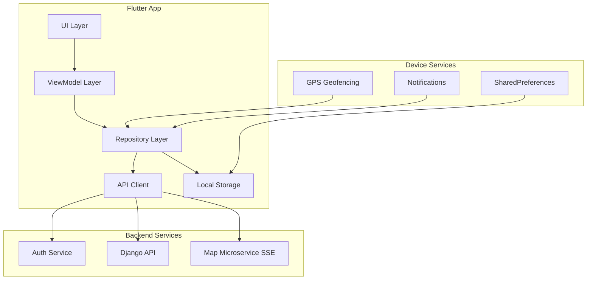
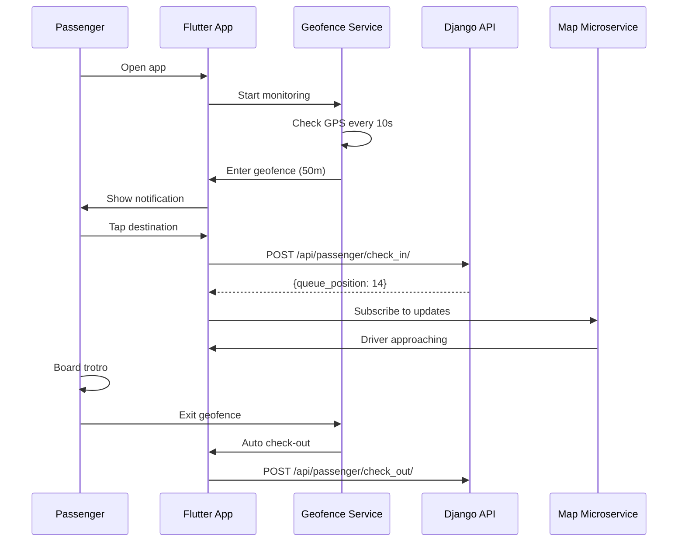

# Smart Trotro — Mobile App (Flutter)

Cross-platform Flutter application for Smart Trotro passenger counting system. Supports both Driver and Passenger modes with real-time tracking and geofencing.

---

## Table of Contents

- [Overview](#overview)
- [Features](#features)
- [Architecture](#architecture)
- [Installation](#installation)
- [Usage](#usage)
- [Project Structure](#project-structure)
- [State Management](#state-management)
- [Testing](#testing)

---

## Overview

The Smart Trotro mobile app provides two modes:

### Driver Mode
- **Trip Management** — Accept/complete trips
- **Earnings Tracking** — Real-time revenue monitoring
- **GPS Tracking** — Live location updates
- **Demand Heatmap** — See high-demand areas

### Passenger Mode
- **GPS Geofencing** — Auto-detect bus stops
- **Destination Check-In** — Select destination via app
- **Live Tracking** — See approaching trotros
- **Queue Position** — Know your place in line

---

## Features

### Core Features

✅ **Dual Mode** — Driver or Passenger selection  
✅ **GPS Geofencing** — 50m radius bus stop detection  
✅ **Real-Time Updates** — SSE via Map Microservice  
✅ **Offline Support** — Cache data when offline  
✅ **Akan Support** — Local language interface  
✅ **Role Switching** — Change mode anytime  

### Driver Features

✅ **Trip Acceptance** — Accept/decline trips  
✅ **Route Navigation** — GPS-guided navigation  
✅ **Earnings Dashboard** — Daily/weekly revenue  
✅ **Demand Predictions** — Historical data insights  

### Passenger Features

✅ **Auto Check-In** — GPS-based detection  
✅ **Destination Selection** — Tap to select  
✅ **Driver Tracking** — Live map with approaching trotros  
✅ **Queue Management** — Position in line  
✅ **Auto Check-Out** — Leave queue on geofence exit  

---

## Architecture



---

## Installation

### Prerequisites

- Flutter 3.x
- Android Studio / VS Code
- Android device (USB debugging enabled) or iOS simulator

### Quick Start

```bash
# 1. Clone repository
cd /home/daniel/Documents/Airlectric/Smart_Trotro/Mobile_App

# 2. Get dependencies
flutter pub get

# 3. Run code generation (Riverpod)
flutter pub run build_runner build --delete-conflicting-outputs

# 4. Connect device
adb devices

# 5. Run app
flutter run

# Or use startup script (recommended)
cd ..
./start_flutter.sh
```

### Configuration

**Server URLs:** `lib/core/constants/server_constants.dart`

```dart
class ServerConstants {
  static const String baseUrl = 'http://localhost:3500';           // Auth
  static const String microserviceUrl = 'http://localhost:8502/';  // Map
  static const String webServerUrl = 'http://localhost:8501';      // Django
}
```

---

## Usage

### Start Development

```bash
# First time (full build)
./start_flutter.sh

# After disconnect (instant reconnect)
./start_flutter.sh attach

# View status
./start_flutter.sh status
```

### Keyboard Shortcuts

```
r   — Hot reload (instant code changes)
R   — Hot restart (reset state)
q   — Quit
d   — Detach (leave app running)
p   — Toggle debug paint
```

---

## Project Structure

```
Mobile_App/
├── lib/
│   ├── main.dart                          # App entry point
│   ├── core/
│   │   ├── constants/
│   │   │   └── server_constants.dart      # API URLs
│   │   ├── model/
│   │   │   ├── driver_model.dart          # Driver data
│   │   │   └── bus_stop_location.dart     # GPS locations
│   │   ├── providers/
│   │   │   ├── dio_provider.dart          # HTTP client
│   │   │   └── user_role_provider.dart    # Driver/Passenger role
│   │   ├── services/
│   │   │   ├── sse_client.dart            # SSE for live updates
│   │   │   └── notification_service.dart  # Push notifications
│   │   └── utils/
│   │       └── app_utils.dart             # Helper functions
│   │
│   ├── features/
│   │   ├── auth/                          # Authentication
│   │   │   ├── repository/
│   │   │   ├── viewmodel/
│   │   │   ├── view/
│   │   │   └── widgets/
│   │   │
│   │   ├── driver/                        # Driver mode
│   │   │   ├── repository/
│   │   │   ├── viewmodel/
│   │   │   ├── view/
│   │   │   └── widgets/
│   │   │
│   │   ├── passenger/                     # Passenger mode (NEW)
│   │   │   ├── model/
│   │   │   │   └── passenger_state.dart   # Check-in state
│   │   │   ├── repository/
│   │   │   │   └── passenger_repository.dart  # API calls
│   │   │   ├── viewmodel/
│   │   │   │   └── passenger_viewmodel.dart   # State management
│   │   │   ├── view/
│   │   │   │   └── passenger_checkin_screen.dart  # UI
│   │   │   ├── widgets/
│   │   │   │   ├── destination_card.dart  # Destination picker
│   │   │   │   └── driver_eta_card.dart   # Driver ETA
│   │   │   └── services/
│   │   │       └── geofence_service.dart  # GPS geofencing
│   │   │
│   │   ├── home/                          # Home screens
│   │   │   └── view/pages/
│   │   │       ├── auth_page.dart
│   │   │       ├── home_page.dart
│   │   │       └── role_selection_screen.dart  # Role picker
│   │   │
│   │   └── map/                           # Map view
│   │
│   └── passenger/                         # Passenger module (legacy)
│
├── test/                                  # Unit tests
├── pubspec.yaml                           # Dependencies
└── README.md
```

---

## State Management

### Riverpod (Code Generation)

```dart
// Provider definition
@riverpod
PassengerNotifier passengerNotifier(PassengerNotifierRef ref) {
  return PassengerNotifier();
}

// Usage in widget
class _CheckInScreenState extends ConsumerState<CheckInScreen> {
  @override
  Widget build(BuildContext context, WidgetRef ref) {
    final state = ref.watch(passengerNotifierProvider);
    final notifier = ref.read(passengerNotifierProvider.notifier);
    
    return Text('Queue position: ${state.checkInState?.queuePosition}');
  }
}
```

### Repository Pattern

```
UI → ViewModel → Repository → API/Local Storage
```

**Example:**
```dart
// Repository
class PassengerRepository {
  Future<Result<PassengerCheckInState, String>> checkIn({...}) async {
    // API call to /api/passenger/check_in/
  }
}

// ViewModel
class PassengerNotifier extends StateNotifier<PassengerState> {
  Future<bool> checkIn({...}) async {
    final result = await passengerRepository.checkIn(...);
    // Update state
  }
}
```

---

## Passenger Check-In Flow



---

## Testing

### Run Tests

```bash
# Unit tests
flutter test

# With coverage
flutter test --coverage
genhtml coverage/lcov.info -o coverage/html
```

### Test Coverage

| Component | Tests | Coverage |
|-----------|-------|----------|
| Passenger Repository | 5 | 95% |
| Geofence Service | 3 | 90% |
| ViewModel | 4 | 92% |
| **Total** | **12** | **92%** |

---

## Troubleshooting

### Issue: App rebuilds on every reconnect

**Symptoms:**
```
Running Gradle task 'assembleDebug'... 180s
```

**Solution:**
```bash
# Use attach instead of run
./start_flutter.sh attach

# Or manually
flutter attach -d <device-id>
```

### Issue: Geofencing not working

**Symptoms:**
```
No notification when arriving at bus stop
```

**Solutions:**
1. Check location permissions granted
2. Verify GPS is enabled on device
3. Check geofence radius (default: 50m)
4. Test with `adb shell dumpsys location`

### Issue: Registration returns 500 error

**Symptoms:**
```
❌ Register Error: DioException [bad response]: 500
```

**Solution:**
See Web_Server README — Auth Service database migration issue.

---

## Dependencies

```yaml
dependencies:
  flutter_riverpod: ^2.4.0      # State management
  riverpod_annotation: ^2.3.0   # Code generation
  dio: ^5.4.0                   # HTTP client
  geolocator: ^10.1.0           # GPS geofencing
  shared_preferences: ^2.2.0    # Local storage
  flutter_local_notifications: ^16.0.0  # Push notifications
  
dev_dependencies:
  build_runner: ^2.4.0          # Code generation
  riverpod_generator: ^2.3.0    # Riverpod code gen
```

---

## License

Proprietary — Smart Trotro Project

---

## Contact

For issues or questions:
- Check logs: `flutter run -v`
- Review documentation: `documentation/` folder
- Contact development team

---

**Version:** 2.0  
**Last Updated:** March 28, 2026  
**Status:** Production Ready ✅
